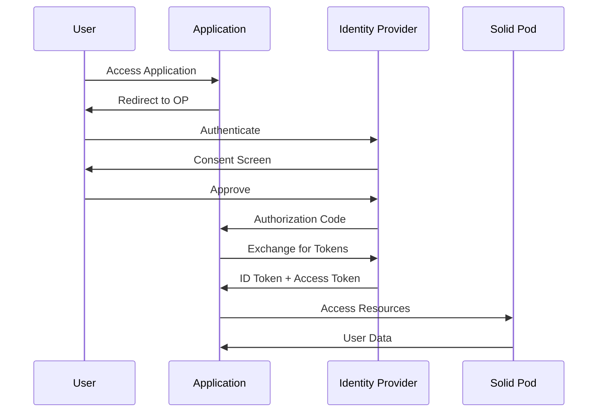

# Technical Architecture

## System Overview

The Solid Federated Auth system provides a decentralized authentication service using the Solid-OIDC protocol, allowing applications to authenticate users through their Solid Pods without storing credentials or personal data.

## Core Components

### 1. Identity Layer

#### WebID (Web Identity)
- **Format**: HTTP(S) URI that dereferences to an RDF document
- **Example**: `https://alice.solidcommunity.net/profile/card#me`
- **Contains**: Public profile, authentication endpoints, storage locations

#### Solid Pod
- Personal data storage server
- Hosts WebID Profile Document
- Stores user preferences and application data
- Controls access permissions

### 2. Authentication Flow



### 3. Protocol Stack

```
┌─────────────────────────────────┐
│     Application Layer           │
├─────────────────────────────────┤
│     Solid-OIDC Protocol         │
├─────────────────────────────────┤
│   OpenID Connect (OIDC)         │
├─────────────────────────────────┤
│      OAuth 2.0 + PKCE           │
├─────────────────────────────────┤
│    DPoP (Proof-of-Possession)   │
├─────────────────────────────────┤
│      HTTPS/TLS 1.3              │
└─────────────────────────────────┘
```

## Security Architecture

### Token Types

1. **ID Token (JWT)**
   - Contains WebID claim
   - Signed by Identity Provider
   - Validates user identity

2. **Access Token**
   - DPoP-bound for enhanced security
   - Short-lived (default: 15 minutes)
   - Scoped to specific resources

3. **Refresh Token**
   - Long-lived token for renewal
   - Stored securely client-side
   - Rotated on use

### DPoP (Demonstrating Proof-of-Possession)
```javascript
// DPoP Token Structure
{
  "typ": "dpop+jwt",
  "alg": "RS256",
  "jwk": { /* public key */ }
}
{
  "jti": "unique-id",
  "htm": "GET",
  "htu": "https://pod.example/resource",
  "iat": 1234567890,
  "ath": "hash-of-access-token"
}
```

### Security Features
- **PKCE**: Prevents authorization code interception
- **DPoP**: Binds tokens to client possession proof
- **Consent**: Explicit user consent for data access
- **Minimal Disclosure**: Only required claims shared
- **Token Rotation**: Automatic refresh token rotation

## Data Flow Architecture

### 1. Registration Phase
```
App → OP: Dynamic Client Registration
OP → App: Client Credentials
App → Storage: Cache credentials
```

### 2. Authentication Phase
```
User → App: Initiate login
App → OP: Authorization request
OP → User: Login form
User → OP: Credentials
OP → User: Consent form
User → OP: Grant consent
OP → App: Authorization code
App → OP: Token exchange
OP → App: Tokens
```

### 3. Resource Access Phase
```
App → Pod: Request + Access Token + DPoP
Pod → OP: Validate token
OP → Pod: Token valid
Pod → App: Resource data
```

## Implementation Architecture

### Client-Side (Browser)
```typescript
// Using @inrupt/solid-client-authn-browser
import { 
  login, 
  handleIncomingRedirect,
  getDefaultSession 
} from '@inrupt/solid-client-authn-browser';

class SolidAuth {
  async authenticate(issuer: string) {
    await login({
      oidcIssuer: issuer,
      redirectUrl: window.location.href,
      clientName: "My App"
    });
  }
  
  async handleCallback() {
    await handleIncomingRedirect();
    const session = getDefaultSession();
    return session.info;
  }
}
```

### Server-Side (Node.js)
```typescript
// Using @inrupt/solid-client-authn-node
import { Session } from '@inrupt/solid-client-authn-node';

class SolidAuthServer {
  private sessions = new Map<string, Session>();
  
  async createSession(sessionId: string) {
    const session = new Session();
    this.sessions.set(sessionId, session);
    return session;
  }
  
  async authenticate(session: Session, webId: string) {
    await session.login({
      oidcIssuer: this.getIssuerFromWebId(webId),
      redirectUrl: this.callbackUrl,
      clientId: this.clientId,
      clientSecret: this.clientSecret
    });
  }
}
```

## Deployment Architecture

### Microservices Design
```
┌──────────────┐     ┌──────────────┐     ┌──────────────┐
│   Auth API   │────▶│   Session    │────▶│   Token      │
│   Gateway    │     │   Manager    │     │   Validator  │
└──────────────┘     └──────────────┘     └──────────────┘
        │                    │                     │
        ▼                    ▼                     ▼
┌──────────────┐     ┌──────────────┐     ┌──────────────┐
│   Client     │     │   Redis      │     │   OP         │
│   Registry   │     │   Cache      │     │   Connector  │
└──────────────┘     └──────────────┘     └──────────────┘
```

### Scalability Considerations

1. **Horizontal Scaling**
   - Stateless authentication service
   - Session storage in Redis
   - Load balancing with sticky sessions

2. **Caching Strategy**
   - WebID profiles: 5 minutes
   - OIDC discovery: 1 hour
   - Token validation: Per token lifetime

3. **High Availability**
   - Multi-region deployment
   - Failover identity providers
   - Circuit breakers for external calls

## Integration Points

### 1. Identity Providers
Compatible with any Solid-OIDC provider:
- Inrupt Pod Spaces
- Solid Community Server
- Node Solid Server (NSS)
- Enterprise Solid Server (ESS)

### 2. Application Types
- **SPAs**: Browser-based authentication
- **Traditional Web**: Server-side flow
- **Mobile**: PKCE + custom URL schemes
- **CLI Tools**: Device code flow
- **APIs**: Client credentials

### 3. Storage Backends
- Solid Pods (primary)
- Extension points for:
  - IPFS
  - Traditional databases
  - Cloud storage

## Performance Optimization

### Token Management
```typescript
class TokenCache {
  private cache = new Map();
  
  async getToken(webId: string): Promise<Token> {
    const cached = this.cache.get(webId);
    if (cached && !this.isExpired(cached)) {
      return cached;
    }
    
    const refreshed = await this.refresh(cached.refreshToken);
    this.cache.set(webId, refreshed);
    return refreshed;
  }
}
```

### Connection Pooling
- Maintain persistent HTTPS connections
- Connection pool per identity provider
- Automatic retry with exponential backoff

## Monitoring & Observability

### Metrics
- Authentication success/failure rates
- Token refresh frequency
- Provider response times
- Session duration

### Logging
```json
{
  "timestamp": "2024-01-30T10:00:00Z",
  "level": "INFO",
  "event": "auth.success",
  "webId": "https://alice.solid.net/profile#me",
  "provider": "solid.community",
  "duration_ms": 245
}
```

### Health Checks
- `/health/live` - Service liveness
- `/health/ready` - Dependencies ready
- `/health/providers` - OP connectivity

## Future Enhancements

### Planned Features
1. **Verifiable Credentials** - W3C VC integration
2. **Multi-factor Authentication** - FIDO2/WebAuthn
3. **Delegation** - Act on behalf of others
4. **Group Management** - Organizational identities
5. **Offline Support** - Cached authentication

### Research Areas
- Zero-knowledge proofs for privacy
- Blockchain identity anchoring
- Decentralized reputation systems
- Homomorphic encryption for pods