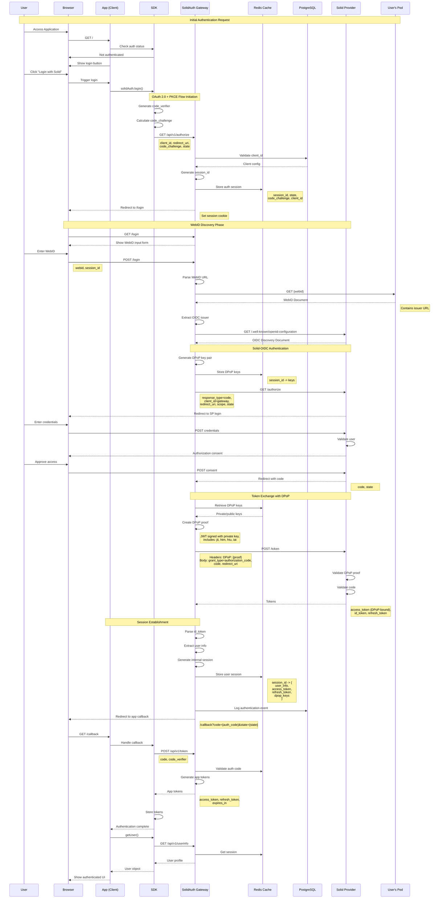
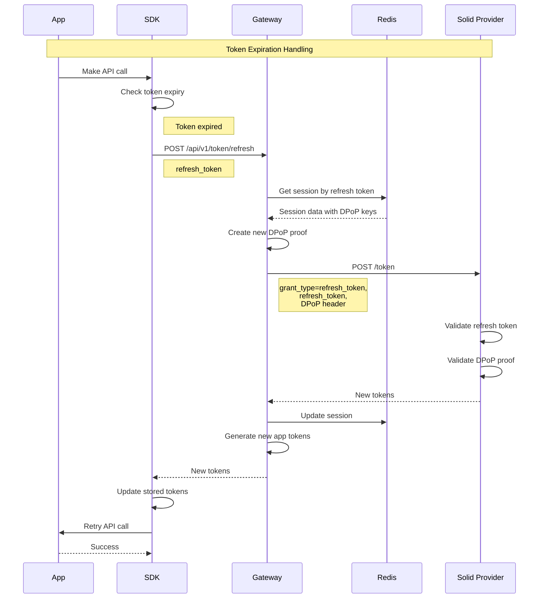
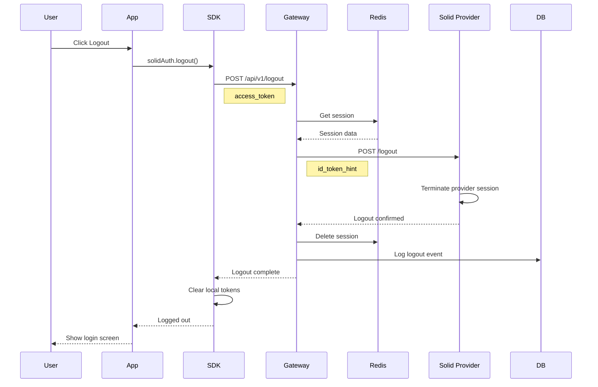
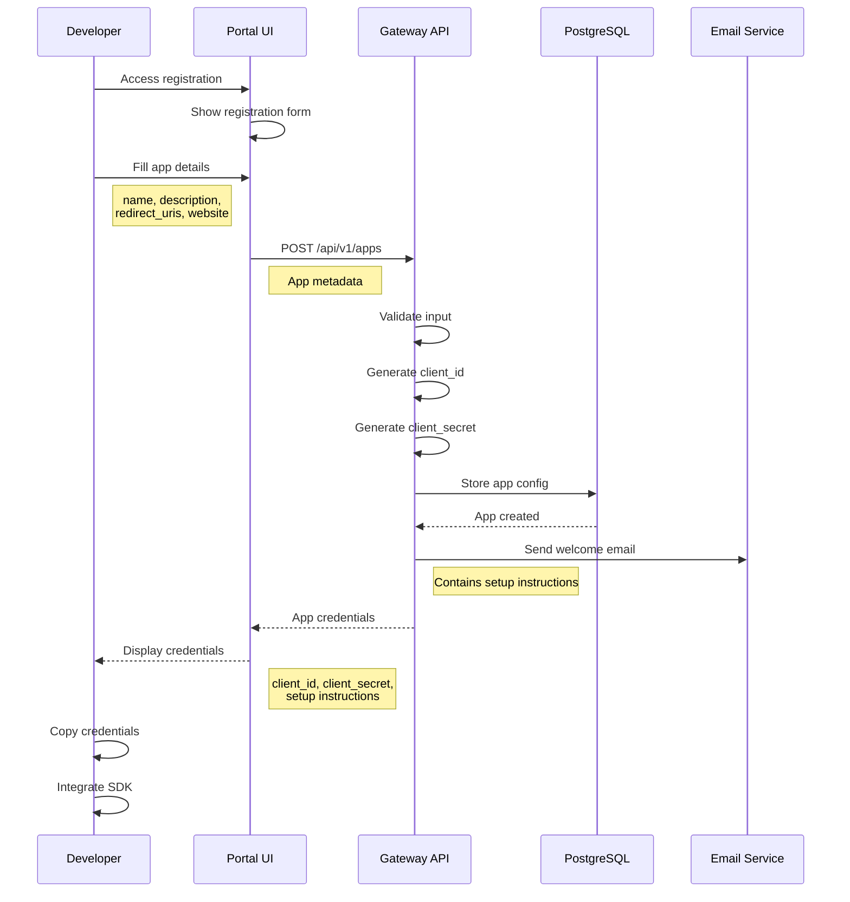
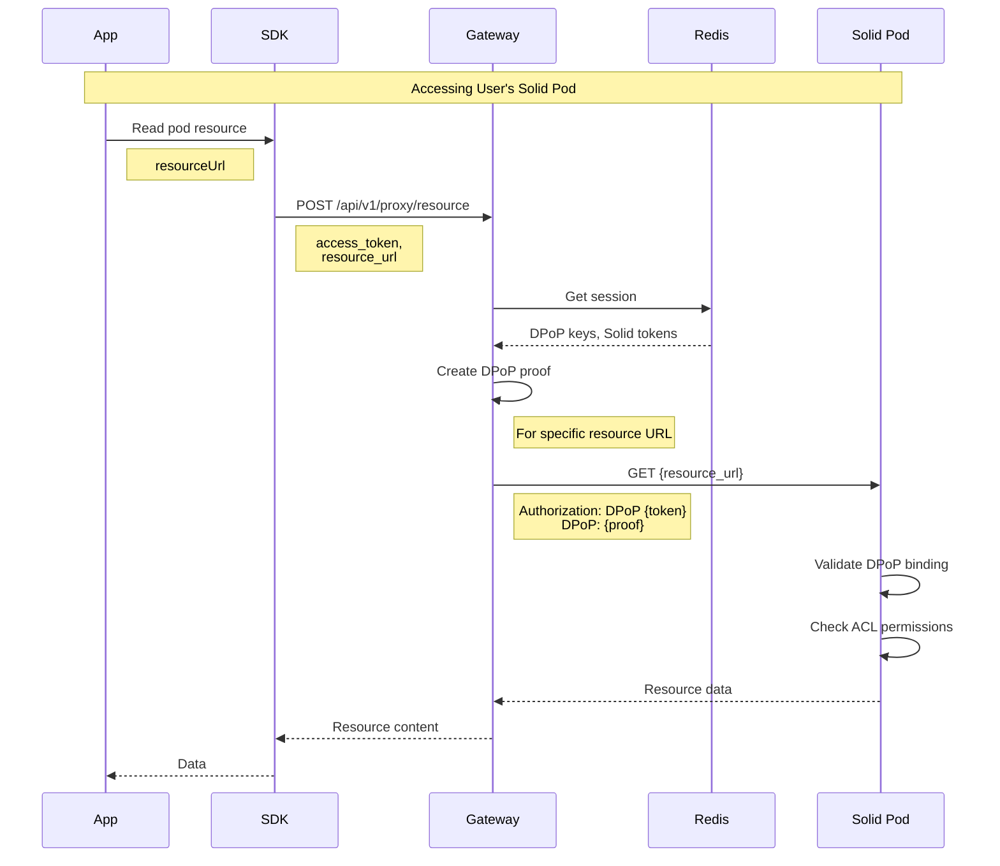
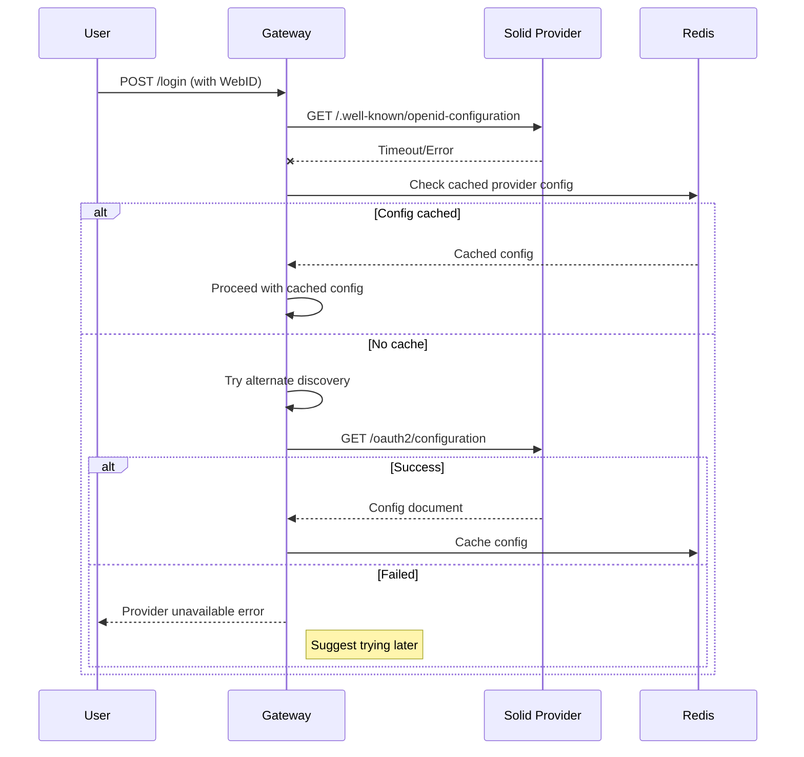
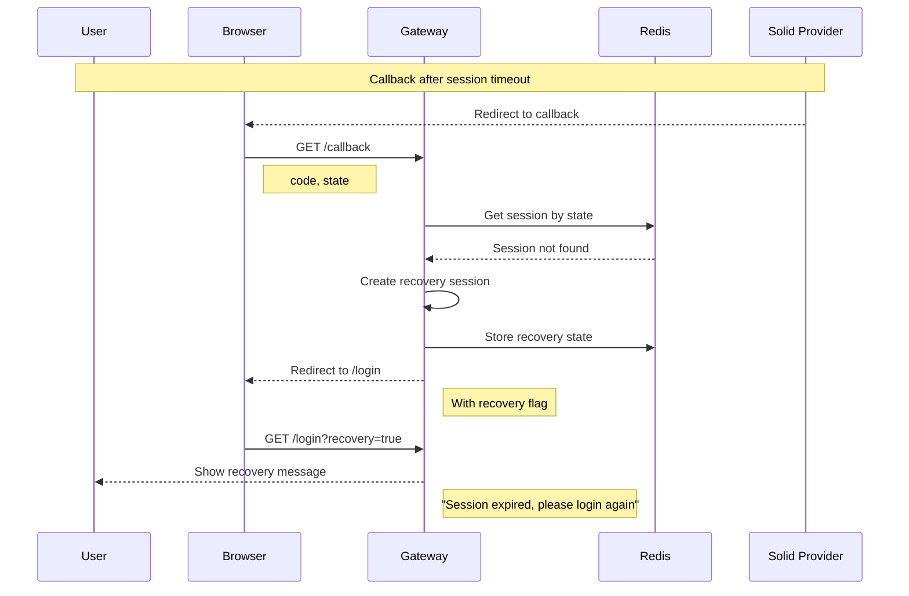
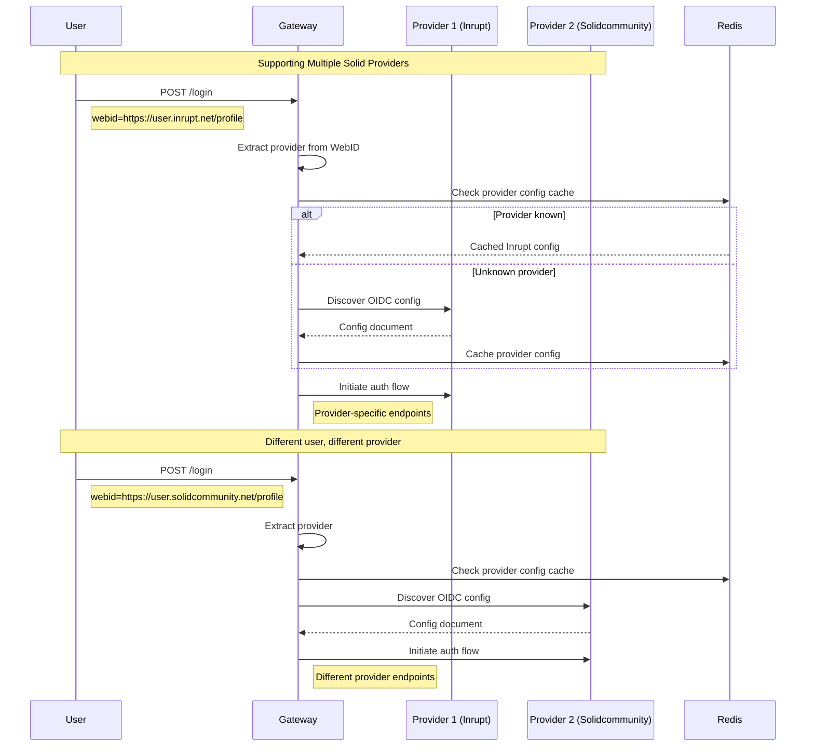
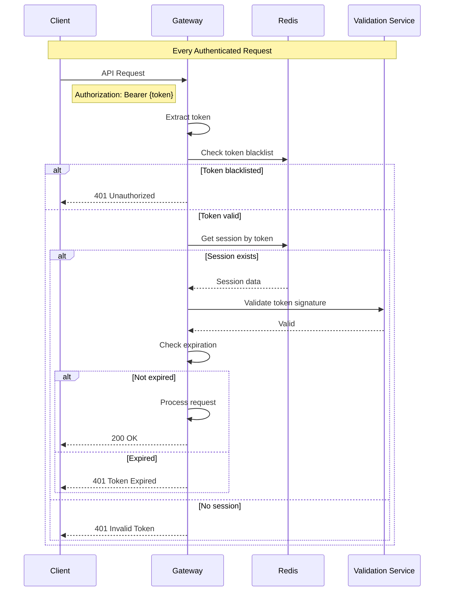

# Authentication Flow Diagrams

## 1. Complete Authentication Flow with DPoP

## 2. Token Refresh Flow

## 3. Logout Flow

## 4. Application Registration Flow

## 5. Resource Access Flow (Using DPoP)

## 6. Error Recovery Flows

### 6.1 Provider Unavailable

### 6.2 Session Expired During Flow

## 7. Multi-Provider Support Flow

## 8. Security Token Validation Flow

## Flow Decision Matrix

| Scenario | Flow Type | Key Considerations |
|----------|-----------|-------------------|
| First-time user | Full authentication | WebID discovery, provider selection |
| Returning user | Session-based | Cookie validation, token refresh |
| API access | Token validation | DPoP proof generation |
| Provider down | Error recovery | Cached configs, retry logic |
| Token expired | Refresh flow | Automatic refresh, seamless UX |
| Logout | Cleanup flow | Provider logout, session cleanup |
| Multiple apps | Shared session | SSO capabilities, session linking |

## Security Checkpoints

Each flow includes the following security validations:

1. **Client Validation**: Verify client_id and redirect_uri
2. **State Parameter**: Prevent CSRF attacks
3. **PKCE**: Prevent authorization code interception
4. **DPoP Binding**: Prevent token replay attacks
5. **Session Binding**: Link sessions to specific clients
6. **Rate Limiting**: Prevent brute force attacks
7. **Input Validation**: Prevent injection attacks
8. **TLS/HTTPS**: Encrypt all communications

## Performance Optimizations

1. **Caching**: Provider configs, user sessions, token validation
2. **Connection Pooling**: Reuse HTTP connections to providers
3. **Async Operations**: Non-blocking I/O for all external calls
4. **Batch Operations**: Group related operations when possible
5. **Lazy Loading**: Load user details only when needed
6. **Token Lifecycle**: Proactive refresh before expiration